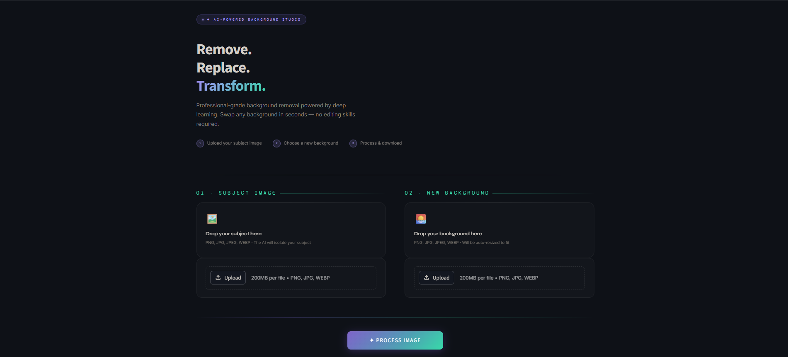
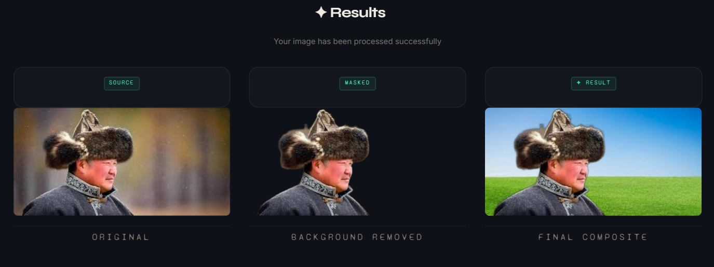

# AI Background Removal & Replacement
A Streamlit-based web application for automatic image background removal and replacement using AI segmentation techniques.

This application allows users to upload an image, automatically remove the original background, replace it with a custom background, and download the final composited image.

---

## Team Members

- Valwa Giraldy — 32230178
- Timothy Antonio — 32230137
- Novandy Amcals — 32230145
- Herry Wijaya — 32230182

---

## Features

- Automatic AI background removal
- Custom background replacement
- Alpha compositing
- Interactive Streamlit web interface
- Downloadable final image
- Support for PNG, JPG, JPEG, and WEBP

---

## Workflow

```text
Upload Foreground Image
        ↓
AI Background Removal
        ↓
Upload New Background
        ↓
Alpha Compositing
        ↓
Download Final Result
```

---

## Libraries Used

| Library | Function |
|---|---|
| Streamlit | Web application interface |
| Pillow (PIL) | Image processing |
| rembg | AI background removal |
| io | Byte stream handling |

---

## Background Removal Process

The application uses the `rembg` library to perform AI-based image segmentation. The foreground object is separated from the original background using segmentation masks and alpha masking techniques.

The removed background is converted into transparent pixels using RGBA alpha channels, allowing seamless compositing with a new uploaded background image.

---

## Application Preview

### Web Interface



---

### Processing Result



---

## Installation

```bash
pip install -r requirements.txt
```

Run the application:

```bash
streamlit run app.py
```

---

## Output Result

The final output image can be downloaded directly from the Streamlit application interface after compositing is completed.
